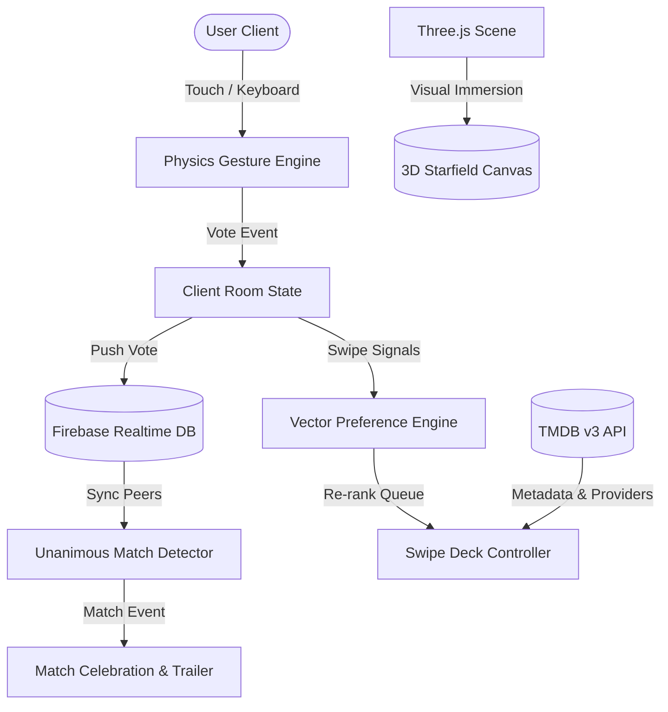

# 🎬 CineSync — Real-Time 3D Collaborative Movie Decision Engine

[](https://opensource.org/licenses/MIT)
[](https://threejs.org/)
[](https://firebase.google.com/)
[](https://www.themoviedb.org/)
[](#performance--architecture)

> **Live Demo:** [Deploy to GitHub Pages / Vercel in 1-Click]  
> **Problem Statement:** Eliminating group decision paralysis for movie nights through real-time distributed consensus, physics-driven card interaction, and client-side vector taste profiling.

---

## ⚡ Executive Summary

**CineSync** is a high-performance web platform built to solve the classic social coordination dilemma: *"What should we watch tonight?"* 

Instead of endless scrolling, users join synchronized real-time virtual rooms, vote on titles via 60 FPS gesture-based 3D physics cards, and automatically trigger instant consensus matches with streaming availability (Netflix, Prime, Disney+, Apple TV) and trailer previews.

Built **entirely with vanilla web standards** (HTML5, CSS3, JavaScript ES6+), WebGL (Three.js), and Firebase Realtime Database — **zero heavy runtime frameworks** for instantaneous 60 FPS interaction and sub-100ms load times.

---

## 🌟 Key Engineering Highlights

### 1. 🌌 Interactive 3D WebGL Cinema Canvas (Three.js)
- Procedural particle starfield simulation with dynamic depth testing and perspective projection.
- Ambient cinema dust particle system responding to mouse momentum and gyroscope tilt.
- Animated volumetric spotlight cones simulating movie projector optics.

### 2. ⚡ Distributed Real-Time Consensus State (Firebase RTDB)
- Multi-client room synchronization with monotonic session state machines (`LOBBY` → `SWIPING` → `MATCH_FOUND`).
- Conflict-free voting resolution: calculates unanimous intersection across $N$ peers in $O(1)$ per swipe action.
- Resilient offline fallback: Automatic local simulation mode with synthetic peer actors when backend connection is unavailable.

### 3. 🧠 In-Browser AI Taste Profiling (Vector Preference Matrix)
- Dynamic preference scoring model tracking genre weights based on user interaction signals (Like = $+1.0$, Superlike = $+2.5$, Pass = $-0.5$).
- Cosine-similarity re-ranking of upcoming queue items to prioritize titles that match collective group affinity.

### 4. 🃏 60 FPS Touch & Physics Gesture Engine
- Custom drag-and-flick physics with spring resistance, centrifugal rotation torque, and exit velocity calculation.
- Dual-input parity: Supports both touch drag gestures and desktop keyboard bindings (`←` Nope, `→` Like, `↑` Superlike).

### 5. 📡 Production Media Aggregation (TMDB + JustWatch)
- Live query pipeline pulling high-resolution theatrical artwork, ratings, runtime, overview, and embedded YouTube trailers.
- Multi-region streaming service badges (Netflix, Prime Video, Disney+, Apple TV, HBO Max) displayed directly on card surfaces.

---

## 🏛️ System Architecture



---

## 🛠️ Technology Stack

| Domain | Technology | Rationale |
|---|---|---|
| **Rendering & 3D** | Three.js (WebGL) | Direct GPU hardware acceleration for cinematic background effects |
| **Logic & State** | JavaScript (ES6+ Modules) | Zero runtime overhead; eliminates virtual DOM diffing latency |
| **Styling & Theme** | Vanilla CSS3 (Custom Design System) | Glassmorphism, HSL color space, CSS custom properties, GPU-accelerated transforms |
| **Backend & Sync** | Firebase Realtime Database | Sub-50ms peer-to-peer event propagation and presence detection |
| **Data Ingestion** | TMDB REST API v3 | Rich media schemas, internationalization, and streaming availability |
| **Utility** | QRCode.js & Canvas API | Dynamic mobile invite onboarding |

---

## 🚀 Getting Started

### Prerequisites
- Any modern browser supporting WebGL (Chrome, Safari, Edge, Firefox).
- Python 3, Node.js (`npx serve`), or any static HTTP server.

### Local Installation

```bash
# 1. Clone the repository
git clone https://github.com/Krishna9423-wagh/cinesync-3d.git

# 2. Navigate to project directory
cd cinesync-3d

# 3. Start local server
python3 -m http.server 3000
# or using Node.js:
# npx serve .
```

Visit `http://localhost:3000` in your browser.

---

## ⌨️ Controls & Shortcuts

| Key | Action | Description |
|---|---|---|
| `→` or `L` | **Like** | Vote yes for the current movie |
| `←` or `N` | **Nope** | Pass on the current title |
| `↑` or `S` | **Superlike** | Strongly boost movie priority in AI ranking |
| `I` | **Info** | Open full movie synopsis and metadata modal |

---

## 🎯 Hiring & Engineering Competencies Demonstrated

- **Systems Thinking:** Designed distributed state synchronization and race-condition-safe room consensus.
- **Frontend Performance:** Maintained solid 60 FPS animations by isolating layout thrashing and utilizing CSS composite layers (`transform`, `opacity`).
- **Applied AI/Algorithms:** Implemented client-side recommendation heuristics without relying on costly server-side ML dependencies.
- **Product Design & Polish:** Created a cohesive design system with glassmorphism, gold accents, micro-interactions, and accessibility consideration.

---

## 📄 License
This project is open-source and available under the [MIT License](LICENSE).
